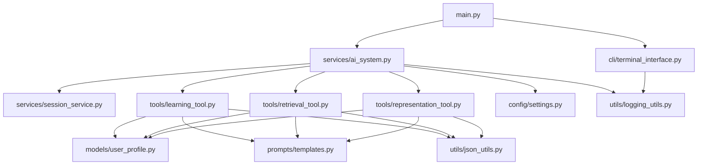

# 🔧 AI Representative System - Refactoring Plan

## 📋 **Current State**
- **File**: `backend/main.py` (786 lines)
- **Issues**: 
  - Single monolithic file with multiple responsibilities
  - Hard to maintain, test, and collaborate on
  - Mixed concerns (AI logic, session management, CLI interface)
  - Complex tool creation methods (100+ lines each)

## 🎯 **Refactoring Goals**

### **Primary Objectives:**
1. **Separation of Concerns** - Each module has a single responsibility
2. **Maintainability** - Smaller, focused files that are easier to understand
3. **Testability** - Individual components can be unit tested
4. **Reusability** - Tools and services can be reused in other contexts
5. **Collaboration** - Multiple developers can work on different modules
6. **Debugging** - Issues are easier to isolate and fix

### **Secondary Objectives:**
- Improve code organization and readability
- Create clear interfaces between components
- Enable easier feature additions and modifications
- Better error handling and logging
- Consistent coding patterns across modules

---

## 📁 **Target File Structure**

```
backend/
├── 📄 main.py                          # Simplified entry point (50-100 lines)
├── 📄 REFACTORING_PLAN.md              # This file
├── 📄 requirements.txt                 # Dependencies
├── 📄 config.example                   # Environment configuration
│
├── 📁 models/                          # Data structures and models
│   ├── 📄 __init__.py                  # ✅ COMPLETED
│   └── 📄 user_profile.py              # ✅ COMPLETED
│
├── 📁 config/                          # Configuration management
│   ├── 📄 __init__.py
│   └── 📄 settings.py                  # Environment variables, validation
│
├── 📁 services/                        # Core business logic
│   ├── 📄 __init__.py
│   ├── 📄 ai_system.py                 # Main AIRepresentativeSystem class
│   └── 📄 session_service.py           # Session management abstraction
│
├── 📁 tools/                           # AI tool implementations
│   ├── 📄 __init__.py
│   ├── 📄 learning_tool.py             # extract_and_learn function
│   ├── 📄 retrieval_tool.py            # smart_answer_about_user function
│   └── 📄 representation_tool.py       # represent_user function
│
├── 📁 prompts/                         # AI prompt templates
│   ├── 📄 __init__.py
│   └── 📄 templates.py                 # All AI prompts centralized
│
├── 📁 utils/                           # Utility functions
│   ├── 📄 __init__.py
│   ├── 📄 json_utils.py                # JSON parsing and validation
│   ├── 📄 response_utils.py            # Response formatting
│   └── 📄 logging_utils.py             # Logging configuration
│
├── 📁 cli/                             # Command-line interface
│   ├── 📄 __init__.py
│   └── 📄 terminal_interface.py        # Terminal UI logic
│
└── 📁 tests/                           # Test files
    ├── 📄 __init__.py
    ├── 📄 test_models.py
    ├── 📄 test_services.py
    ├── 📄 test_tools.py
    └── 📄 test_integration.py
```

---

## 🚀 **Implementation Phases**

### **Phase 1: Foundation** ✅ **COMPLETED**
- [x] Create `models/` package with `UserProfile` and `ExtractedInfo`
- [x] Set up proper `__init__.py` exports

### **Phase 2: Configuration** 🔄 **NEXT**
- [ ] Create `config/settings.py` for environment management
- [ ] Extract database URL and API key configuration
- [ ] Add validation and default values

### **Phase 3: Core Services**
- [ ] Create `services/ai_system.py` - Main system class
- [ ] Create `services/session_service.py` - Session management
- [ ] Move initialization logic from main.py

### **Phase 4: AI Tools**
- [ ] Extract `tools/learning_tool.py` (extract_and_learn)
- [ ] Extract `tools/retrieval_tool.py` (smart_answer_about_user)
- [ ] Extract `tools/representation_tool.py` (represent_user)
- [ ] Create tool factory/registry

### **Phase 5: Prompt Management**
- [ ] Create `prompts/templates.py` with all AI prompts
- [ ] Centralize prompt engineering logic
- [ ] Add prompt versioning and management

### **Phase 6: Utilities**
- [ ] Create `utils/json_utils.py` for JSON operations
- [ ] Create `utils/response_utils.py` for response formatting
- [ ] Create `utils/logging_utils.py` for consistent logging

### **Phase 7: CLI Interface**
- [ ] Extract `cli/terminal_interface.py` from main()
- [ ] Separate UI logic from business logic
- [ ] Add command-line argument parsing

### **Phase 8: Testing & Cleanup**
- [ ] Create comprehensive test suite
- [ ] Update main.py to be a simple orchestrator
- [ ] Add error handling and logging
- [ ] Performance optimization

---

## 📊 **File Size Targets**

| File | Current | Target | Purpose |
|------|---------|--------|---------|
| `main.py` | 786 lines | 50-100 lines | Entry point only |
| `services/ai_system.py` | - | 200-300 lines | Core system logic |
| `tools/learning_tool.py` | - | 150-200 lines | Learning functionality |
| `tools/retrieval_tool.py` | - | 150-200 lines | Smart retrieval |
| `tools/representation_tool.py` | - | 100-150 lines | User representation |
| `config/settings.py` | - | 50-100 lines | Configuration |
| `cli/terminal_interface.py` | - | 100-150 lines | CLI interface |

---

## 🔗 **Module Dependencies**



---

## 🧪 **Testing Strategy**

### **Unit Tests:**
- Test each model class independently
- Test individual tool functions
- Test configuration loading
- Test utility functions

### **Integration Tests:**
- Test service interactions
- Test end-to-end chat flow
- Test session persistence
- Test AI tool integration

### **Test Coverage Goals:**
- **Models**: 95%+ coverage
- **Services**: 90%+ coverage
- **Tools**: 85%+ coverage
- **Utils**: 95%+ coverage

---

## 📝 **Code Quality Standards**

### **Documentation:**
- All public methods have docstrings
- Type hints for all function parameters and returns
- README files for each major module
- Inline comments for complex logic

### **Error Handling:**
- Consistent exception handling patterns
- Proper logging at appropriate levels
- Graceful degradation for non-critical failures
- User-friendly error messages

### **Performance:**
- Async/await patterns maintained
- Efficient database queries
- Minimal memory usage
- Fast startup times

---

## 🎯 **Success Metrics**

### **Code Quality:**
- [ ] Reduce main.py from 786 to <100 lines
- [ ] Achieve 90%+ test coverage
- [ ] Zero linting errors
- [ ] All modules have <300 lines

### **Maintainability:**
- [ ] New features can be added without modifying existing modules
- [ ] Individual components can be tested in isolation
- [ ] Clear separation between UI, business logic, and data layers
- [ ] Easy to onboard new developers

### **Functionality:**
- [ ] All existing features work identically
- [ ] No performance regression
- [ ] Improved error handling and logging
- [ ] Better debugging capabilities

---

## 🚨 **Migration Risks & Mitigation**

### **Risks:**
1. **Breaking existing functionality**
2. **Import/dependency issues**
3. **Session state compatibility**
4. **Performance degradation**

### **Mitigation:**
1. **Incremental refactoring** - one module at a time
2. **Comprehensive testing** - before and after each change
3. **Backup current working version**
4. **Feature flags** for gradual rollout
5. **Performance monitoring** throughout process

---

## 📅 **Timeline Estimate**

| Phase | Duration | Dependencies |
|-------|----------|--------------|
| Phase 1 | ✅ Complete | None |
| Phase 2 | 1-2 days | Phase 1 |
| Phase 3 | 2-3 days | Phase 2 |
| Phase 4 | 3-4 days | Phase 3 |
| Phase 5 | 1-2 days | Phase 4 |
| Phase 6 | 1-2 days | Phase 5 |
| Phase 7 | 1-2 days | Phase 6 |
| Phase 8 | 2-3 days | All phases |

**Total Estimated Time: 11-18 days**

---

## 🎉 **Post-Refactoring Benefits**

1. **Developer Experience:**
   - Easier to understand and modify code
   - Faster debugging and issue resolution
   - Better IDE support and autocomplete
   - Clearer code organization

2. **System Reliability:**
   - Better error handling and logging
   - Easier to add monitoring and metrics
   - More robust session management
   - Improved test coverage

3. **Future Development:**
   - Easy to add new AI tools
   - Simple to extend user profile features
   - Straightforward to add new interfaces (web, API)
   - Clear path for scaling and optimization

---

*This refactoring plan provides a clear roadmap for transforming the monolithic `main.py` into a well-structured, maintainable codebase while preserving all existing functionality.*
